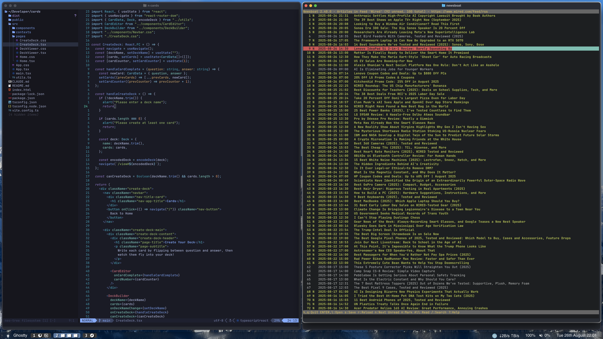

Run .install.sh for automatic setup
```
curl -L https://raw.githubusercontent.com/ofietze/dotfiles/main/.install.sh | sh
```
For the karbiner config you'll have to open karabiner elmentts and add the complex cusotm config in .karabiner-complex-mod-caps-lock
